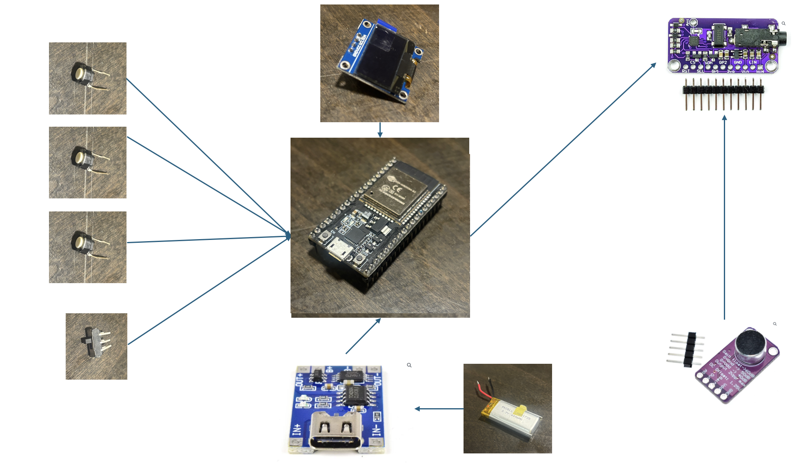
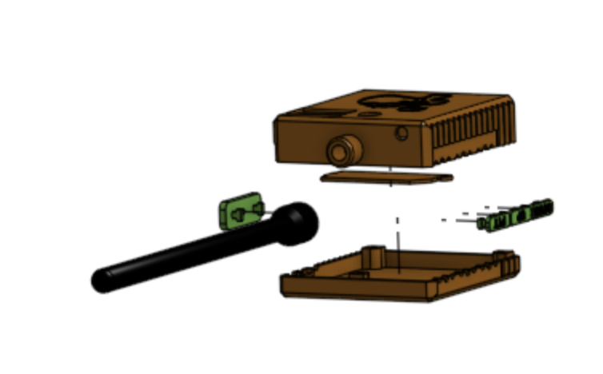

# Foghorn

  

A short range portable FM transmitter.

---

## Table of Contents

- [Overview](#overview)
- [Project Structure](#project-structure)
- [Hardware](#hardware)
- [Firmware](#firmware)

---

## Overview

This is an FM transmitter that a user can use to broadcast their voice or audio from an AUX port on the FM band at short ranges. As an audio source, it uses either an onboard microphone or the external AUX port. The user can transmit their voice much like a walkie talkie, and can play music if they want. The transmitter is tunable to any FM band frequency using buttons.

  

The project was originally named Foghorn because I had imagined it as a megaphone. I though this would allow for some interesting antenna design, and also be funny. However, after realizing that the antenna didn't matter too much, I fell to the tempation of making it smaller, and so a radio design was born.

Foghorn is built on a series of development boards. An ESP32 board provides the computing, which is connected to an electret microphone, LCD screen, FM transmitter, and the buttons and switches needed to run the device. The whole thing is powered by a lithium ion battery, rechargable using a battery board. Firmware is written using ESP-IDF.

  

---

## Project Structure

This repository contains everything involved with this project. Some of the main folders are as follows.

- admin: Administrative stuff, such as a log, BoM, pictures, etc.
- arduino: Code used with an Arduino Uno to test out the FM transmitter.
- main: Firmware for the ESP32, used in the final version.
- stls: STL files used for mechanical parts (3D printed).

## Hardware

### Electronics

This device consists of several development boards and other odd electronics. A sketch of the system is shown below.

  

All parts are wired together using 26AWG wire and heat shrink.

#### Battery Board (BB)

The battery board is a board that allows for the charging of my lithium ion battery. I don't know what kind of battery it is (3.7V 400mAh) cause I just had it lying around. The battery board provides 3.3V and ground terminals for the entire system. The BB can be found here: https://www.universal-solder.ca/product/3-7v-lithium-charger-usb-c-1a-charge-3a-output-protection-usb-c/

#### FM transmitter

The FM transmitter is connected to the ESP32 via I2C and the microphone using a single line. It transmits at a short range on the FM band. An approximately 20cm wire antenna extends out from this board. You can find it here: https://www.universal-solder.ca/product/si4713-fm-stereo-transmitter-module-with-rds/

#### Microphone

The microphone is an electret microphone board with adjustable gain. I have it set to the lowest setting (40dB) right now, which works fine. Its analog output is connected to the analog input of the FM transmitter. Find it here: https://www.universal-solder.ca/product/hifi-microphone-module-with-max9814-amplifier/

#### LCD

THe LCD is a 4056 powered 128x64 I2C LCD. It is connected on the I2C lines to the ESP32 board. This provides a 0.97" monochrome display to display the frequency. I don't have a link cause it was just lying around.

#### ESP32

The ESP is connected to all of the peripherals. Also just had this lying around, so no link for you. It's a pretty standard ESP dev board though.

#### IO

There are 3 buttons and one switch. The switch is on the 3.3V line between the battery board and the rest of the system. THe push to talk button is on the analog audio line between the FM transmitter and the microphone. The up and down frequency buttons are connected to two ESP32 GPIO inputs.

### Mechanical

Most parts are 3D printed using my Prusa Mk3S+ printer. The case is made from brown ASA, the buttons from green ABS, and the antenna from flexible TPU. Parts are fastened together using M2.5 screws and heat inserts. The buttons and switch are glued in.

  

Parts were designed in Onshape. Note that M2.5 screws was a bad choice, since these take up more space than necessary and don't fit in the microphone or LCD mounting holes (although for the LCD I made it happen).

  

## Firmware

The current firmware is in the "main" folder. This firmware is responsible for interacting with all of the peripherals. All processing happens in a single task. The initialization flow is as follows.

1. Initialize I2C (LCD and FM transmitter)
2. Initialize GPIO
3. Initialize LCD
4. Initialize FM transmitter (begin transmitting)
5. Display initial frequency on LCD

Once initialization is complete, we enter the main loop. If the frequency up button is pressed, the frequency is increased by 0.2 MHz and the FM transmitter is tuned to match. The new frequency is displayed. I'll let your imagination fill in what happens when the frequency down button is pressed.

In the background, the LCD screen is constantly updated. Otherwise, the only task the ESP32 performs is monitoring the frequency up and frequency down buttons.

Code is fairly sparsly commented, and has undergone some pretty major shifts, so I make no claims to this being particularily robust or clean work.
