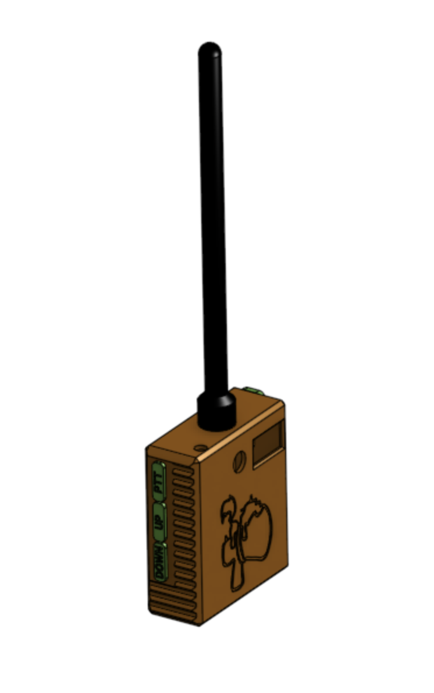

# Foghorn

  

A short range portable FM transmitter.

---

## Table of Contents

- [Overview](#overview)
- [Features](#features)
- [Project Structure](#project-structure)
- [Firmware](#firmware)
- [Hardware](#hardware)
- [Build](#build)

---

## Overview

This is an FM transmitter that a user can use to broadcast their voice or audio from an AUX port on the FM band at short ranges. 

---

## Features

- Modular hardware design with STL files for 3D printing
- Embedded firmware written in C/C++ for [target microcontroller]
- Admin
